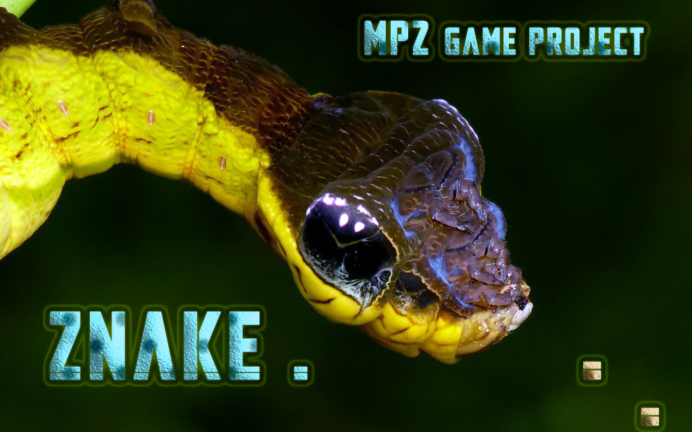
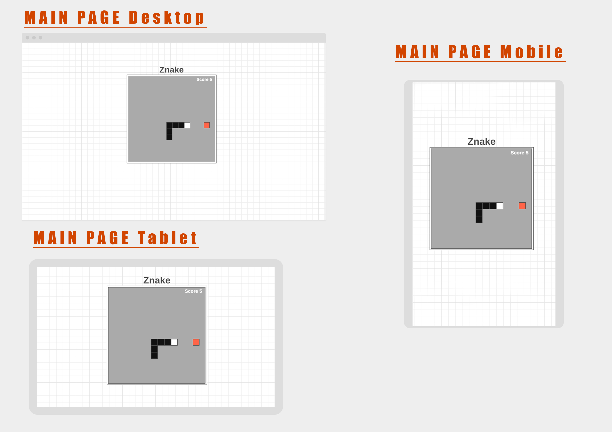
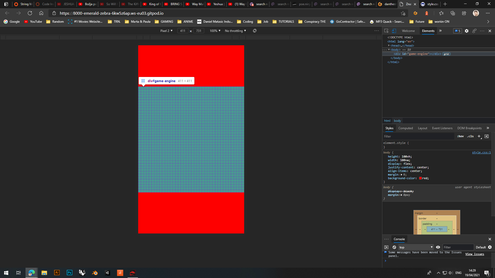

# **Znake Game** 

### Interactive Frontend Development Milestone Project 2, Project Example Idea 2

### Website presents "Znake" my first 2D JavaScript Game built form scratch and with still low knowledge on JS with attempt of creating the usual snake game.

### This project is for educational purposes and can not be used as a template for a business use. Website is aboute the game "snake", a simple game made by html css and mostly of the code is writen in JS files.  

###  **[Site is published at github pages](https://danthestar.github.io/MS2/)**     
---
---
## **Content Tree**
---
---

- [UX](#ux)
    - [Owner goals](#owner-goals)
    - [User goals](#user-goals)
    - [Structure of the website](#structure-of-the-website)
    - [Wireframes](#wireframes)
    - [Surface](#surface)
- [Features](#features)
  - [All pages](#all-pages)
  - [Features Left to Implement](#features-left-to-implement)
- [Technologies Used](#technologies-used)
- [Testing](#testing)
    - [Functionality testing](#functionality-testing)
    - [Compatibility testing](#compatibility-testing)
    - [Performance testing](#performance-testing)
- [Deployment](#deployment)
- [Credits](#credits)
- [Screenshots](#screenshots)
---
---
## UX
---
---
## Owner goals
---
#### Goal was to build simple and intresting website/Game  on 2D plane.
#### One of the reason way i started to do Coding University it THIS = to be able to create somehting that works and can be applied to everywhere and everyone. One of my huge goals it still to be able to create way more complex structures applications and games in near future, so by doing "Snake " game., that is already huge step for me. 
#### And so far this is the best part for me personaly - even though i don't understand all of JS rules and behaviors, but I am fulfilled while doing this type of work/delight.
---
## User goals
---
### As for user goals
   * encourage others to similar projects 
   * to have fun while playing the game
   * even though we are just beginners this should not prevent us from aiming high
   * more happiness less stressing
   * life is a game
   * less is more 

## **Structure of the website**
---
The website/Game is designed to be minimalistictic, with cleans and simple outlook. Mainly focus was on platforms that have keyboards/arrow keys, but it will be nice if i manage to make them available for the smartphones as well! Sinc eit my first game ever (in coding terms) i will stick again more on side of functionality and code it self how to use it than the visual identity.

## **Wireframes**
---
* I used website [Wireframe.cc](https://wireframe.cc/) to create a wireframes, with addition of Photoshop ofc.

## **Surface**
---

### Colors
Main colours:
* background color: none
* main name title color: work in progress
* score color: white
* bezel color: work in progress
* znake color: work in progress
* food color: work in progress

### Fonts 
   1. Bangers = [Google Fonts Library](https://fonts.google.com/) 
   2. sans-serif as a backup!
   
### Images

* Images from Google will be all credite in [credits](#credits) section.

### Sounds
*  I used [ZapSplat](https://www.zapsplat.com/sound-effect-categories/) Free source sound effect webpage for sounds. 

[Back to Content Tree](#content-tree)

---
---
## Features
---
---

### The website contains One pages. 

### **Game page** 
*  one page where game is centred on page, vertically and horizontally
* contains game window (20x20 tails) where "znake" is moving in search of "food" 
*  score indication in right upper corner
*  title name slightly above the game "Znake"

### **Features Left to Implement**
* defenetly more levels with higer spee dor harder dificolty in some maners
* some type of star scoring: so players can leav 1-5 star grade
* it will be nice to make the same game in 3D environment
* implement way more different context, just for practise and it will make game more hi-tech and more attractive!
* implement score name options - so the other players will try to beat the higest score
* make it multiplayer!!

---
---
## **Technologies Used**
---
---
### **Core structure**
* HTML5

### **Style language**
* CSS

### **Interactions**
* All interactions are done by Java Script

### **Fonts**
* [Google Fonts Library](https://fonts.google.com/)   // still working on it
* [Google Fonts Library](https://fonts.google.com/)   // still working on it
  
### **Storage**
* GitHub - As a software hosting platform to keep project in a remote location.

### **Coding platform**
* Gitpod - As a development hosting platform.

### Wireframe.cc
* As a wireframing tool.

### **Image editor**
* Photoshop

[Back to Content Tree](#content-tree)

---
---
## **Testing**
---
---

### **Functionality testing** 

  * Most of the time i was doing this topic, testing, testing and a bit more testing the code and checking on inspect how will my code change trough css.
  * Im using Microsoft Edge/Chrome

### **Compatibility testing**
 Since it original ymade only for keyboard platform, compability testing was smuth on all similar platforms!

 ## Performance testing
---
I use [Lighthouse](https://developers.google.com/web/tools/lighthouse/) tool to check performance of the website.
I had to do couple of changes to improve performance. Screenshots are presented below:

### Issues during site development

* To be honest, only issues was typo mistakes. And that usually consume a lot of time and discourages, only to eventually find that the code is good, but it has one letter of excess or missing semicolon that makes the whole code not work  
* Some of them was me trying to figure it out, how the code is working...

  
getting familiar how tiels and ticks work trough inspector options

  [Back to Content Tree](#content-tree)
---
---
## **Deployment**
---
---
The project was deployed on GitHub Pages. I used Gitpod as a development environment where I commited all changes to github. I used push command in Gitpod to save changes into GitHub.
* ###   Your site is published at https://danthestar.github.io/the-mandalorian/
---
---
## **Credits**
---
---
   
####  To complete this project I used Code Institute student template: [gitpod-full-template](https://www.youtube.com/watch?v=QTcIXok9wNY&t=27s)

### **Idea**
* In the beginning i wasn't sure what how or way to start: what game to make an dwhat Style
  * but with consulting my self with student suppoort and my mentor Adegbenga Adeye, i agree with them to stick to something simple
  * so since my entire reason to start doing coding was to be able to start doing in game development or application development, snake game was best pick
* But since this is my first JS actual coding, i needed a model that i can follow and understand, those bellow are some of my picks form where i was able to recreate my Znake game
    
  * i try my best to not use same names as the source of my code, so by doing that i hope i avoid at least some of copy/paste related issues confronting forms about violation of use someone's code
  * and it also beneficial for me if i change all the names - so i can use more of my own thinking in order to figure it out how the code operates
  1. [Web Dev Simplified ](https://www.youtube.com/watch?v=QTcIXok9wNY&t=27s) = How To Code The Snake Game In Javascript (code with him seams way simpler :D)
  2. [Coding With Adam](https://www.youtube.com/watch?v=7Azlj0f9vas&t=745s) = Coding Snake in JavaScript Complete Tutorial Every Step Explained with HTML5 Canvas (i was following thi one as my main source of code)
  3. [Franks laboratory](https://www.youtube.com/watch?v=jl29qI62XPg&t=1477s) = JavaScript 2D Game Tutorial (visual enrichment)

### **Content**
* The base for main structure in similar to structuro of [Coding With Adam](https://www.youtube.com/watch?v=7Azlj0f9vas&t=745s) from where i take mouste of it
* Readme file inspirations are my previous md.file 
  * [danthestar/the-mandalorian](https://github.com/danthestar/the-mandalorian/blob/master/README.md) on GitHub
  

### **Media**

* **jpg files** all my photos are Photoshoped after being downloaded form free source
     * 1.        
     * 2. 
     * 3. 

## [Back to Content Tree](#content-tree)    
      
             
* **all others links that i have used as inspiration or understanding how can i make something:**
   * [Web Dev Simplified ](https://www.youtube.com/watch?v=QTcIXok9wNY&t=27s) inspirations for coding development = especially in game department
   * [Coding With Adam](https://www.youtube.com/watch?v=7Azlj0f9vas&t=745s) inspirations for coding development = especially in game department
   * [Franks laboratory](https://www.youtube.com/watch?v=jl29qI62XPg&t=1477s) inspirations for coding development = especially in game department
   * [KnifeCircus](https://www.youtube.com/watch?v=bG2BmmYr9NQ&t=5s) inspirations for coding development = especially in game department
  
* **Icons** 
  * used fom [Font Awesom](https://fontawesome.com/icons?d=gallery&m=free)  // still working on it

* **Fonts** 
    * **Lato:** from [Google Fonts Library](https://fonts.google.com/)  // still working on it
    * **mandalore:** from [Picture and Magic](https://www.picturethemagic.com/?s=mandalore)  // still working on it
    * **waltDisney:** from [Picture and Magic](https://www.picturethemagic.com/free-disney-fonts/)   // still working on it
---
### **Acknowledgements**
---
* **Special Thanks to:**
    * my Mentor - **Adegbenga Adeye**.
    * all the **Tutor Assistance** (even tho i didn't use them as mutch)
    * **HUGE** thanks to all girls and guys in the **[Slack Community](https://slack.com/intl/en-ie/)** for providing constant and quite fast response time for every my query!!
        * no matter how stupid that query my be
    * **Student Care** for constant care and providers of usuefull additional information out side of follow lectures
    * Troubleshooting Tips - it a handy
    * youtube content creators
    * and everyone else who supports me on this Coding journey
--- 
[Back to Content Tree](#content-tree)
### *Daniel Matasic*
